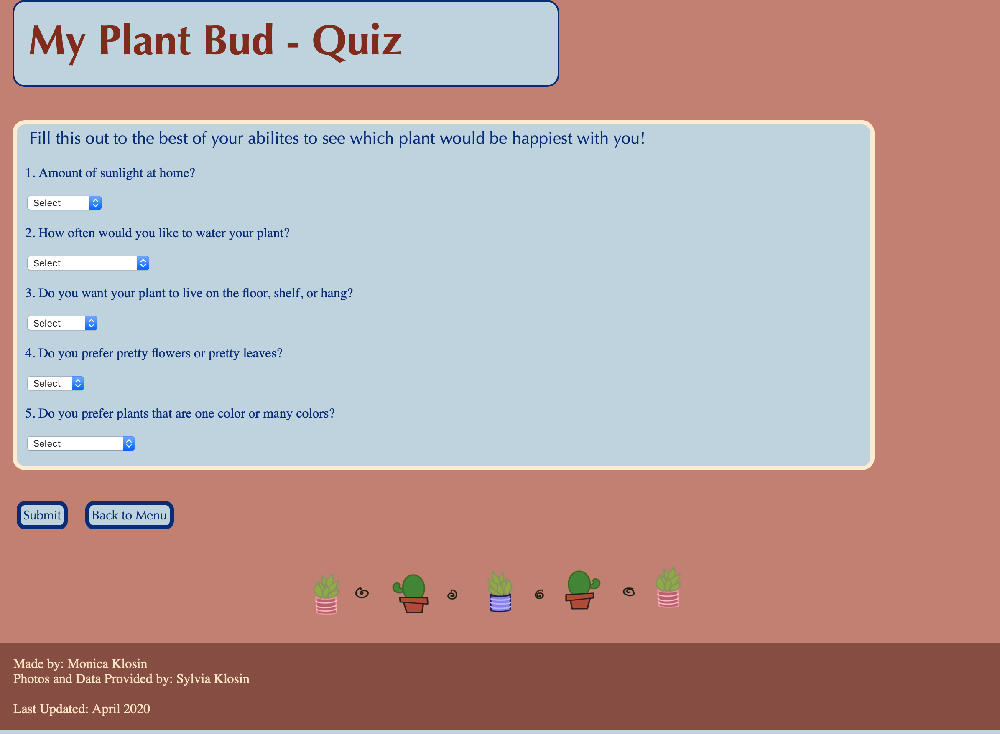
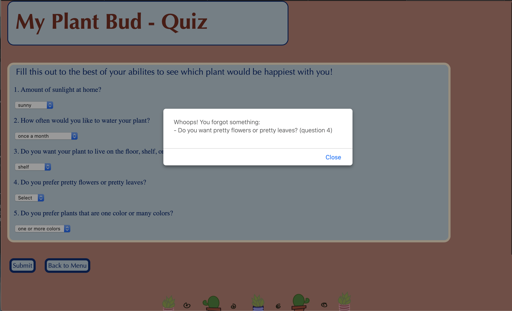
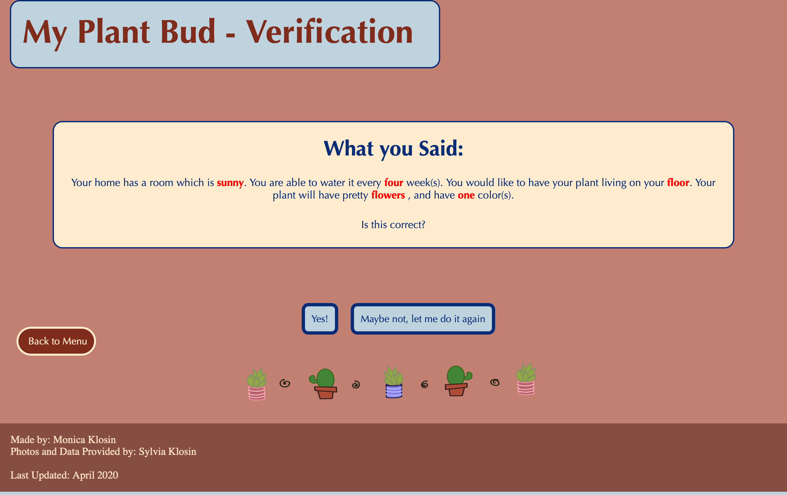
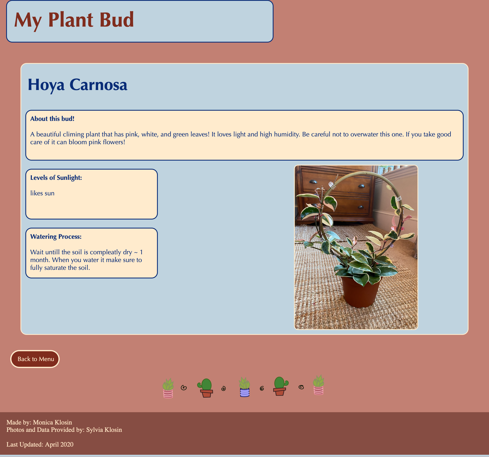

# MyPlantBud </br>

A website holding information about house plants. Users can take a quiz to see which plant would be best for their lifestyle or just browse the possible plants they could have.

____________________________________________________________________________________

When the user goes to https://myplantbud.herokuapp.com/MyPlantBud, they will see this page: </br>
<p align="center">

</p>
Here, the user can either click on an image of a plant to be directed to a page holding info of the plant, or take a quiz to see which plant would be best suited for their lifestyle. </br>

______________________________________________________________________________

### Quiz </br>

If the user clicks on "Take Quiz", they will be sent to this page: </br>
<p align="center">

</p>
The user must select an options for all questions, if they don't, they will be alerted of their mistake and told to answer the question(s): </br>
<p align="center">

</p>
Otherwise, if the user answered all questions and they click submit, they will go to the verification page. </br>


______________________________________________________________________________

### Verification </br>

<p align="center">

</p>

After completing the quiz, the user will be shown a page with their selected options, and then asked if these answers are correct or not. If the user clicks "Maybe not, let me do it again", they will be sent back to the quiz page. </br>
If the user clicks "Yes!", then the assigned plant page will render.

______________________________________________________________________________

### Plant Page </br>

This is the same page that will show if the user selects from the home screen a plant picture. The page renders based on which plant is called in the URL (the picture below is where the id for the plant Hoya is 5).
</br>
```
https://myplantbud.herokuapp.com/plant/{plant id}
```
</br>
After all this work, the user finds out what house plant they would be happy with (in this case, a Hoya!). The user can read some fun facts about their plant bud, as well as see specifically the amount of sunlight and the specific watering process their plant bud will need. </br>

<p align="center">

</p>

______________________________________________________________________________

Last Updated: April 2020 </br>
Pictures and data provided by my sister, Syliva Klosin https://github.com/klosins (thank you Sylv!)